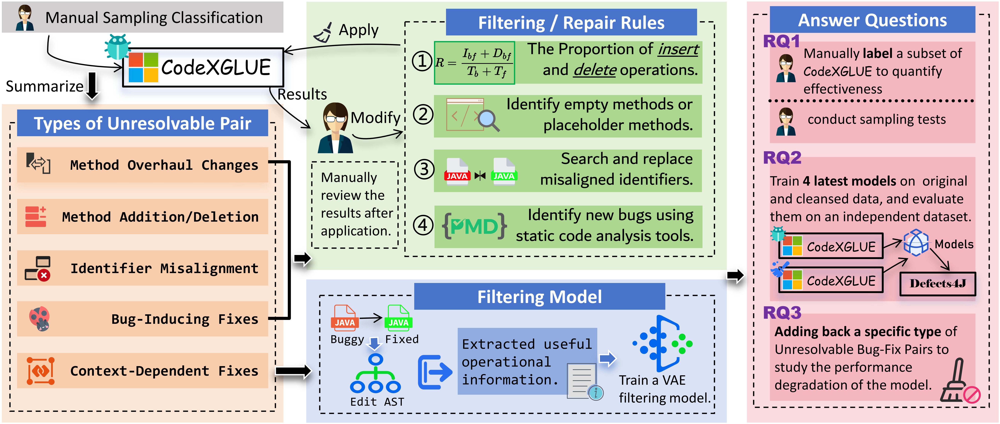

# Cleansed-CodeXGLUE

## What is this repository?
This is the official repository for the paper **Are We Building on Unreliable Ground? A Case Study on Unresolvable Pairs in Learning-based Code Repair**. It includes three parts: 

- [The cleansed-CodeXGLUE](#the-benchmark);
- [500 carefully annotated bug-fix pairs & manual sampling inspection](#500-samples-and-manual-inspection).
- [All the experimental code of this case study](#our-filters);

Learning-based code repair models rely heavily on benchmark datasets for both training and evaluation.
CodeXGLUE, one of the most widely used benchmarks in the field, serves as the standard for evaluating many
of these models. However, the quality of such benchmarks is often overlooked, which can have a substantial
impact on the validity of models evaluation. This case study focuses on the issue of unresolvable bug-fix pairs
within CodeXGLUE—pairs that cannot be resolved at the method-level granularity. These pairs are potentially
skewing both model evaluation and training outcomes. Given the widespread use of CodeXGLUE, flaws in
this benchmark mean that the evaluation of many models could be problematic, raising concerns about the
reliability of results across the field. To assess the impact of these unresolvable pairs, we systematically classify
and remove them from CodeXGLUE, then use it to reassess the models’ performance. Our findings demonstrate
that the presence of unresolvable bug-fix pairs can mislead the evaluation and even result in incorrect ranking
of different models performance. Moreover, after removing these pairs from CodeXGLUE, the latest four
models show an average performance improvement of 5.3% when evaluated on Defects4J. Ultimately, our case
study casts doubt on the reliability of benchmarks with unresolvable pairs for learning-based code repair.

## The benchmark
The benchmark we constructed is released under the `benchmark` directory.

### 1. What's new for this benchmark?
It includes the **cleansed-CodeXGLUE** benchmark, which is the dataset filtered through our filters, and experiments have proven that this dataset is better than the original.

Defects4J is the most commonly used dataset for software bug analysis and debugging research in the Java language. This dataset consists of real software bugs from multiple popular open-source Java projects, each bug has undergone rigorous review and confirmation. Compared to the large-scale dataset CodeXGLUE used for generative learning, Defects4J is characterized by its smaller scale, but each bug-fix pair is rigorously verified. In our experiments, we introduced Defects4J as an absolutely impartial evaluation standard to fairly assess whether our filters improves the performance of the model. Before this, we need to process Defects4J into the same method-level form as CodeXGLUE for model inference. Since each bug in this dataset is fixed with a single commit, we analyze the commits in each project to obtain the code before and after debugging as bug-fix pairs, and then use CodeXGLUE's abstraction tool to abstract these bug-fix pairs. In the end, we successfully obtained 882 bug-fix pairs. We released the reconstructed benchmark as an important supplement to cleansed-CodeXGLUE, because it does not contain defective bug-fix pairs, allowing for a more accurate evaluation of model performance.

### 2. The composition of the benchmark.
- `benchmark/cleansed-CodeXGLUE`: The cleansed-CodeXGLUE dataset, filtered through our filters, includes two parts: a training set and a test set.

- `benchmark/defects4j-formatted`: The aforementioned Defects4J dataset, formatted the same as CodeXGLUE after our processing, is used for a more reliable evaluation.

## 500-samples and manual inspection 
- `samples/500samples-annotated`: Each pair was scored on a five-point Likert scale (-2 to 2).

- `samples/500samples-annotated`: The results of our sampling inspection of each filter.

## Our Filters

### 1. What is our filters

we designed four filtering rules and a filtering model to address these issues. The rules were iteratively refined based on trial-and-error and manual verification, ensuring they effectively removed unresolvable pairs from CodeXGLUE, which is presented. For the more complex
Context-Dependent Fixes, we developed a filtering model based on Edit Abstract Syntax Tree (Edit-AST) and trained a variational autoencoder (VAE) to distinguish context-dependent changes from internal ones.

### 2. How to reproduce the experimental results

First, you should download the original CodeXGLUE dataset via [this link](https://github.com/microsoft/CodeXGLUE), In addition, you need to ensure that your environment is equipped with the following tools (we strongly recommend using a stable Ubuntu OS):

- [Gumtree](https://github.com/GumTreeDiff/gumtree?tab=readme-ov-file): An awesome code differencing tool.
- [tree-sitter](https://github.com/tree-sitter/tree-sitter): An incremental parsing system for programming tools.
- [CXG-B2F-abstraction-tool](https://github.com/micheletufano/src2abs): src2abs is a tool that abstracts Java source code.
- [PMD](https://pmd.github.io/):An extensible cross-language static code analyzer.

Next, you need to install the necessary packages using the following command:

`pip install -r requirements.txt`

Then, you need to execute the following two pieces of code to extract AST edit operations:

`javac ./java_process/src/.../get_actions.java`

`javac ./java_process/src/.../get_ept_actions.java`

Finally, you can run the following code to execute out filters:

`python ./cleaner/puri.py`

+ **For RQ1**: you can directly review the results of our manual sampling inspection, or you can conduct your own sampling inspection on the output of PURI above.

+ **For RQ2**:
You need to train the LSTM-A, CodeBERT, CodeT5, and CodeGPT models on the CXG-B2F dataset both before and after filtering, as well as on a controlled dataset. You can configure the models as you desire and implement this by executing the following code:

    `python ./code-refinement/code/train.py`

+ **For RQ3**:
You need to comment out the various components of `puri.py` individually, then run our filters to obtain the dataset required for the ablation study, and subsequently repeat the training steps outlined in RQ2.

