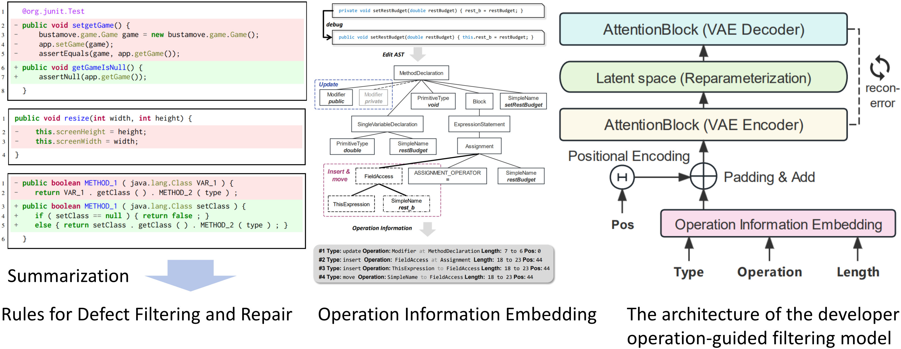

# cleansed-CodeXGLUE

## What is this repository?
This is the official repository for the paper **Data Quality Matters: A Case Study of Learning-based Automated Program Repair**. It includes three parts: 
- [All the experimental code of the PURI method](#puri-method);
- [The benchmark we constructed](#the-benchmark);
- [The results of manual sampling inspection](#sampling-inspection-results).

## PURI Method

### 1. What is PURI?

PURI (**P**urifier for **U**nclean **R**epair **I**nputs), which can effectively filter or repair defective BFPs (Bug-Fix-Pair) in CXG-B2F. It consists of two parts: a rule-based method and a model-based method. The rule-based method is composed of four meticulously designed rules, which were constructed by manually analyzing and summarizing patterns of common defective BFPs. The model-based method is designed based on the notion that developer operations indicate whether they are debugging. We designed a developer operations-guided filtering model using a Variational Autoencoder (VAE) architecture. The model parses a series of atomic operations, encodes and trains them, achieving effective semantic-level filtering of non-debugging operations.

### 2. How to reproduce the experimental results of PURI?

First, you should download the original CXG-B2F dataset via [this link](https://github.com/microsoft/CodeXGLUE), In addition, you need to ensure that your environment is equipped with the following tools (we strongly recommend using a stable Ubuntu OS):

- [Gumtree](https://github.com/GumTreeDiff/gumtree?tab=readme-ov-file): An awesome code differencing tool.
- [tree-sitter](https://github.com/tree-sitter/tree-sitter): An incremental parsing system for programming tools.
- [CXG-B2F-abstraction-tool](https://github.com/micheletufano/src2abs): src2abs is a tool that abstracts Java source code.
- [PMD](https://pmd.github.io/):An extensible cross-language static code analyzer.

Next, you need to install the necessary packages using the following command:

`pip install -r requirements.txt`

Then, you need to execute the following two pieces of code to extract AST edit operations:

`javac ./java_process/src/.../get_actions.java`

`javac ./java_process/src/.../get_ept_actions.java`

Finally, you can run the following code to execute PURI:

`python ./cleaner/puri.py`

+ **For RQ1**: you can directly review the results of our manual sampling inspection, or you can conduct your own sampling inspection on the output of PURI above.

+ **For RQ2**:
You need to train the LSTM-A, CodeBERT, CodeT5, and CodeGPT models on the CXG-B2F dataset both before and after filtering, as well as on a controlled dataset. You can configure the models as you desire and implement this by executing the following code:

    `python ./code-refinement/code/train.py`

+ **For RQ3**:
You need to comment out the various components of `puri.py` individually, then run PURI to obtain the dataset required for the ablation study, and subsequently repeat the training steps outlined in RQ2.

## The Benchmark
The benchmark we constructed is released under the `benchmark` directory.

### 1. What's new for this benchmark?
It includes the improved CXG-B2F dataset, which is the dataset filtered through our PURI method, and experiments have proven that this dataset is better than the original.

Defects4J is the most commonly used dataset for software bug analysis and debugging research in the Java language. This dataset consists of real software bugs from multiple popular open-source Java projects, each bug has undergone rigorous review and confirmation. Compared to the large-scale dataset CXG-B2F used for generative learning, Defects4J is characterized by its smaller scale, but each BFP is rigorously verified. In our experiments, we introduced Defects4J as an absolutely impartial evaluation standard to fairly assess whether PURI improves the performance of the model. Before this, we need to process Defects4J into the same method-level form as CXG-B2F for model inference. Since each bug in this dataset is fixed with a single commit, we analyze the commits in each project to obtain the code before and after debugging as BFPs, and then use CXG-B2F’s abstraction tool to abstract these BFPs. In the end, we successfully obtained 882 BFPs. We released the reconstructed benchmark as an important supplement to CXG-B2F, because it does not contain defective BFPs, allowing for a more accurate evaluation of model performance.

### 2. The composition of the benchmark.
- `benchmark/CXG-B2F-clean`: The improved CXG-B2F dataset, filtered through our PURI method, includes two parts: a training set and a test set.

- `benchmark/defects4j-formatted`: The aforementioned Defects4J dataset, formatted the same as CXG-B2F after our processing, is used for a more reliable evaluation.

## Sampling Inspection Results
Detailed results are stored in the `sampling` folder
